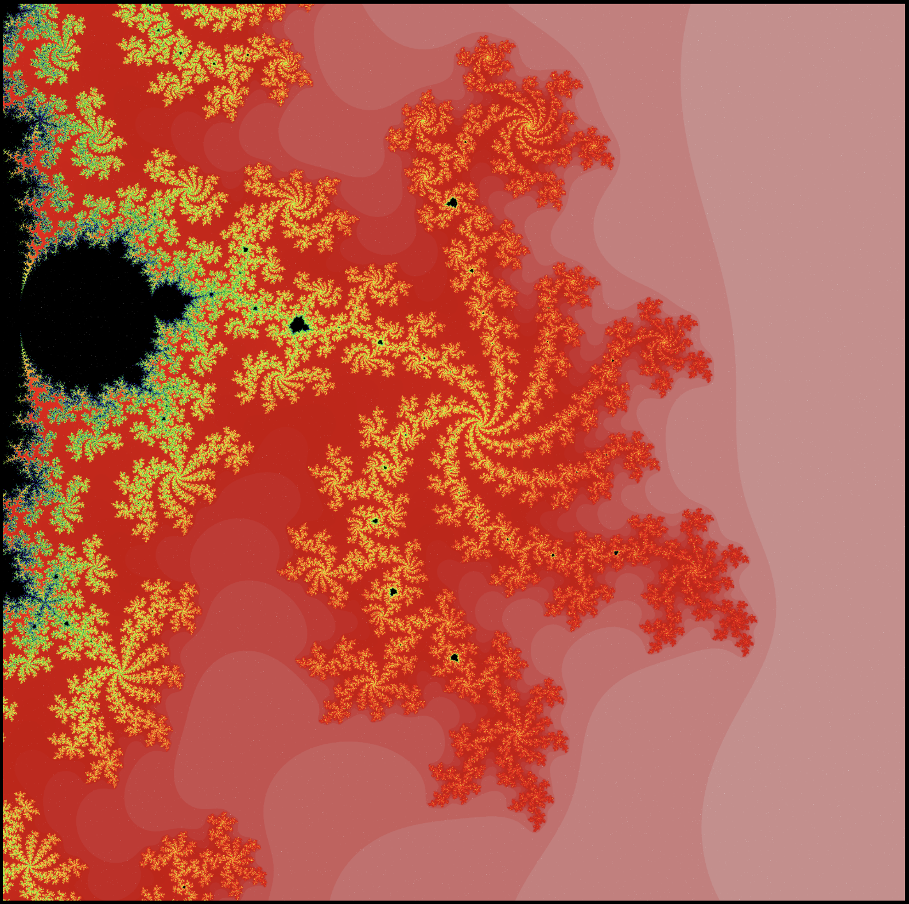
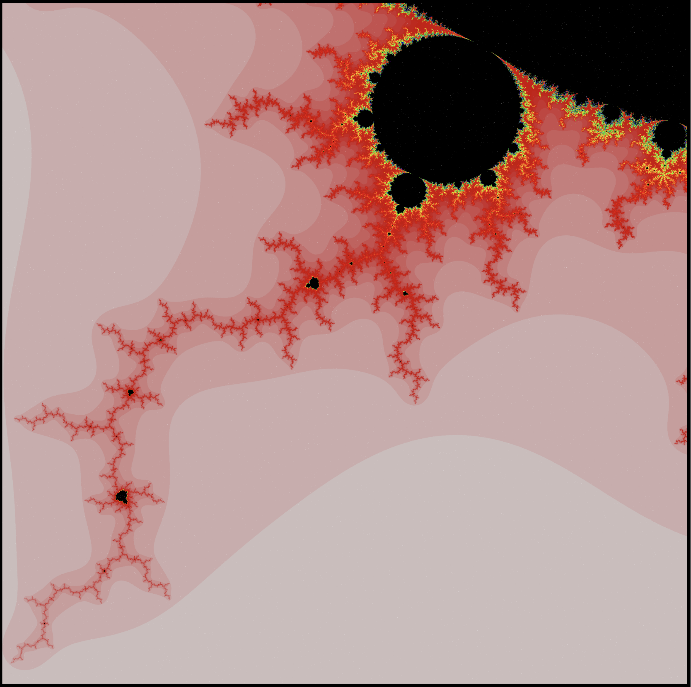

# Estimating the Area of the Mandelbrot Set
Investigating the area of the Mandelbrot set using Monte Carlo integration methods by analysing sampled complex numbers generated using various sampling methods and iterating them through the function f_c(c) = z^2 + c.

# Also some nice visuals :)

Full overview of the mandelbrot set, -2 < x < 1 and -1.2 < y < -1.2

The Seahorse,  -0.751 < x < -0.745 and -0.1 < y < -0.092

0.1375 < x < 0.1625 and -0.6275 < y < -0.6025

-1.3 < x < -1.05 and -0.45 < y < -0.2

